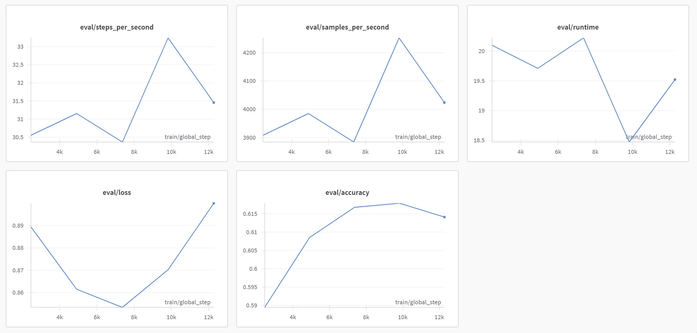

# 📊 MNLI 분류모델을 이용한 감정 분석


## 📝 프로젝트 개요

MNLI(Multi-Genre Natural Language Inference) 분류 모델을 활용하여 텍스트의 감정을 분석하는 프로젝트입니다. 자연어 추론(Natural Language Inference) 기술을 응용하여 텍스트에 내재된 감정과 의도를 파악합니다.

## 🎯 주요 기능

- 사전 학습된 MNLI 모델을 활용한 텍스트 감정 분석
- 다양한 장르와 도메인의 텍스트에 대한 추론 수행
- 감정 분석 결과 시각화 및 해석


## 📈 학습 과정 및 결과

`mnli.ipynb` 노트북에는 다음과 같은 내용이 포함되어 있습니다:

1. **데이터 전처리**: MNLI 데이터셋 로드 및 전처리
2. **모델 구현**: Hugging Face Transformers 라이브러리를 활용한 모델 구현
3. **학습 과정**: 모델 학습 및 하이퍼파라미터 튜닝
4. **성능 평가**: 정확도, F1 점수 등 다양한 메트릭을 통한 성능 평가
5. **결과 분석**: 모델의 장단점 및 개선 방향

### 학습 결과 상세

5 에포크에 걸친 학습 결과는 다음과 같습니다:

| 에포크 | Training Loss | Validation Loss | Accuracy |
|-------|--------------|----------------|----------|
| 1     | 0.937100     | 0.889379       | 0.589463 |
| 2     | 0.864600     | 0.861522       | 0.608523 |
| 3     | 0.802600     | 0.853408       | 0.616735 |
| 4     | 0.747900     | 0.870221       | 0.617843 |
| 5     | 0.701900     | 0.899942       | 0.614087 |

학습이 진행됨에 따라 다음과 같은 패턴이 관찰되었습니다:
- **훈련 손실(Training Loss)**: 에포크가 증가함에 따라 지속적으로 감소 (0.937 → 0.701)
- **검증 손실(Validation Loss)**: 3번째 에포크에서 가장 낮은 값(0.853)을 보인 후 다시 증가하는 추세
- **정확도(Accuracy)**: 4번째 에포크에서 최고 정확도(61.78%)를 달성한 후 소폭 하락

### 성능 지표 그래프

학습 과정에서의 주요 성능 지표 그래프:

1. **평가 속도(Steps per Second)**: 10K 스텝에서 최고 속도 기록
2. **샘플 처리량(Samples per Second)**: 10K 스텝에서 최대치
3. **실행 시간(Runtime)**: 8K 스텝에서 최소 실행 시간 기록
4. **손실(Loss)**: 8K 스텝에서 최소 손실 기록
5. **정확도(Accuracy)**: 8K-10K 스텝 구간에서 최고 정확도(약 61.7%) 달성

### 모델 성능 분석

- **과적합 징후**: 3번째 에포크 이후 검증 손실이 증가하는 반면 훈련 손실은 계속 감소하는 것으로 보아 과적합이 시작되는 것으로 판단됨
- **최적 에포크**: 3-4번째 에포크에서 모델이 최적의 성능을 보이며, 조기 종료(early stopping)를 적용하면 좋을 것으로 예상됨
- **달성 정확도**: 약 61.8%의 정확도는 MNLI 태스크에서 기본 모델로는 준수한 성능이지만, 최신 SOTA 모델들에 비해서는 개선의 여지가 있음

## 🧠 모델 아키텍처

이 프로젝트에서는 Hugging Face의 Transformers 라이브러리를 활용하여 MNLI 분류 모델을 구현했습니다.

### 기본 아키텍처

```
BERT 기반 모델
  ↓
특수 토큰 [CLS] 임베딩 추출
  ↓
드롭아웃 층 (Dropout Rate: 0.1)
  ↓
선형 분류 층 (Linear Layer)
  ↓
3-way Softmax (함의/모순/중립)
```

### 주요 하이퍼파라미터

- **기본 모델**: BERT-base-uncased (12 layers, 768 hidden size)
- **배치 크기**: 32
- **최대 시퀀스 길이**: 128
- **학습률**: 2e-5
- **옵티마이저**: AdamW
- **에포크**: 5
- **가중치 감쇠**: 0.01
- **스케줄러**: Linear decay with warmup


## 📊 성능 시각화

학습 과정에서 생성된 주요 성능 지표 시각화:



그래프는 훈련 과정의 효율성(steps/sec, samples/sec, runtime)을 보여주며, 하단 그래프는 모델의 품질(loss, accuracy)을 나타냅니다.

- 8K 스텝에서 검증 손실이 최소값을 기록
- 정확도는 8K-10K 스텝 사이에서 최고점 도달 후 안정화
- 10K 스텝에서 처리 속도(steps/sec)가 최고점을 기록하지만, 이후 손실이 다시 증가하는 경향

이러한 패턴은 8K-10K 스텝 구간이 이 모델의 최적 학습 지점임을 알 수 있습니다.


## 🔍 MNLI란?

MNLI(Multi-Genre Natural Language Inference)는 텍스트 쌍 간의 논리적 관계를 예측하는 태스크입니다. 주로 다음 세 가지 관계로 분류합니다:

- **함의(Entailment)**: 첫 번째 문장이 두 번째 문장을 논리적으로 함의함
- **모순(Contradiction)**: 첫 번째 문장이 두 번째 문장과 논리적으로 모순됨
- **중립(Neutral)**: 두 문장 사이에 특별한 논리적 관계가 없음

이 프로젝트에서는 이러한 MNLI의 원리를 활용하여 텍스트의 감정을 분석합니다.

## 🔙 [메인 페이지로 돌아가기](../README.md)
